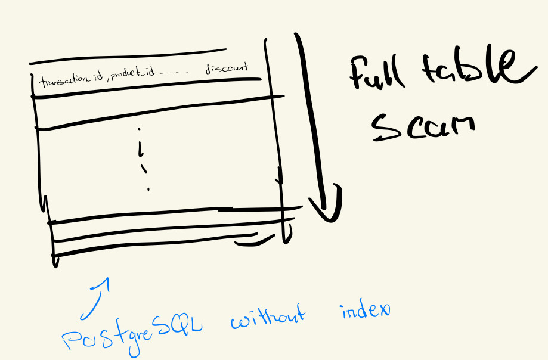
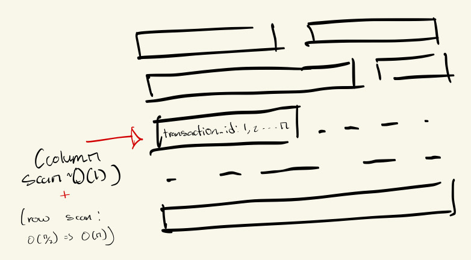
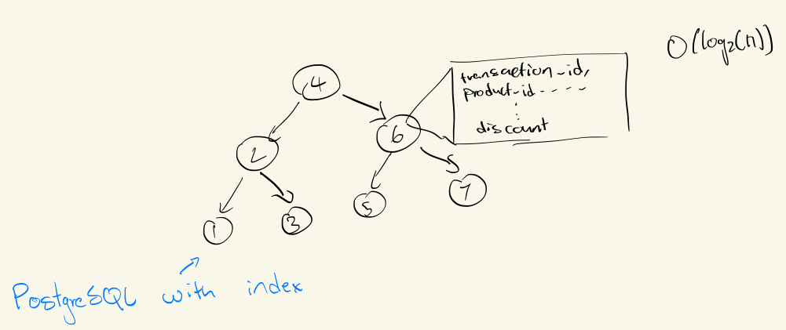
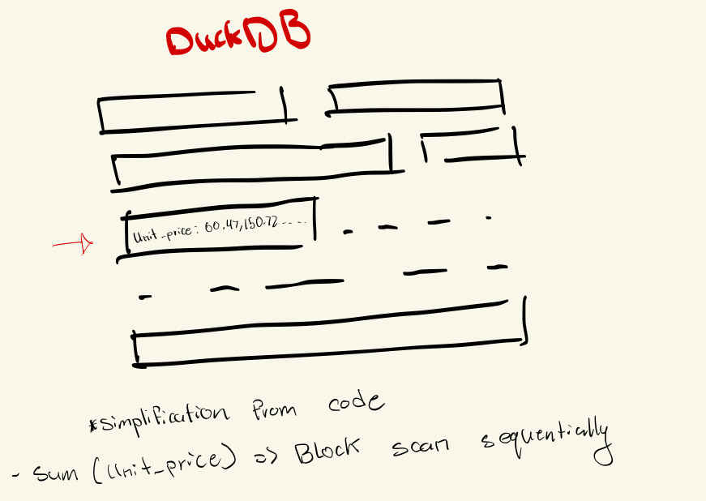
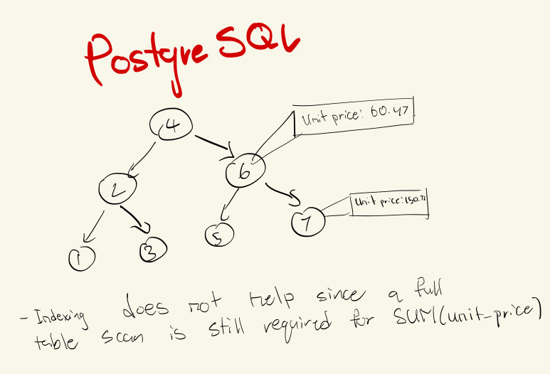

# 📊 Row vs. Column-Oriented Database Benchmark

This project demonstrates the **performance differences** between:

- **Row-Oriented Database**: PostgreSQL
- **Column-Oriented Database**: DuckDB

It answers the question:

> **Which architecture performs better for which type of workload?**

---

## 🧪 Test Workloads

The benchmark evaluates two main database use cases:

- **OLTP (Online Transaction Processing)** – Fetching individual, complete records
- **OLAP (Online Analytical Processing)** – Aggregating data across millions of rows

---

## 🧾 Benchmark Results

Tested on a dataset of **5 million sales transactions**:

| **Test Scenario**               | **PostgreSQL Time** | **DuckDB Time** | **Winner**    |
| ------------------------------- | ------------------- | --------------- | ------------- |
| Data Loading                    | 261.52s             | 2.53s           | 🏆 DuckDB     |
| Test 1: Point Lookup (OLTP)     | 4.95s               | 0.16s           | 🏆 DuckDB     |
| Test 1: Point Lookup (w/ Index) | 0.015s              | 0.16s           | 🏆 PostgreSQL |
| Test 2: Aggregation (OLAP)      | 1.33s               | 0.19s           | 🏆 DuckDB     |
| Test 3: Aggregation (w/ Index)  | 1.20s               | 0.19s           | 🏆 DuckDB     |

---

## 📈 Analysis & Explanation

### 🔹 Data Loading

- **DuckDB** is optimized for large, bulk ingestion.
- **PostgreSQL** takes longer due to transactional overhead (e.g., WAL logging).

---

### 🔹 Test 1: Fetching a Single Record (OLTP)

Without an index:

- Both databases do a full scan—**slow**.

With an index:

- **PostgreSQL shines.**
  As a row-store, it can directly jump to the relevant row using a B-Tree index.

📌 **Why PostgreSQL wins OLTP:**
Rows are stored together; indexed lookups are fast and efficient.

>  >  > 

---

### 🔹 Test 2 & 3: Aggregating Data (OLAP)

- **DuckDB dominates** due to columnar storage.
- Aggregations like `SUM(quantity * unit_price)` only read the necessary columns.

📌 **Why DuckDB wins OLAP:**
It only reads the relevant columns—no wasted I/O on unused data.

Even with an index, PostgreSQL cannot match the inherent efficiency of column-stores.

>  > 
>
> - **Row-oriented layout**: Rows with multiple columns, showing skipped data
> - **Column-oriented layout**: Blocks of each column, highlighting efficient reads

---

## 🧠 For Your Own Knowledge: A Simpler Explanation

Imagine your data as a **giant spreadsheet**:

### Row-Oriented = **Standard Spreadsheet** (PostgreSQL)

- Data stored: `Row 1: [ID, Name, Age]`, `Row 2: [ID, Name, Age]`, ...
- **Fetching a person’s info**: Very fast (entire row is together)
- **Averaging all ages**: Inefficient—you read everything just to get to "Age"

### Column-Oriented = **Flipped Spreadsheet** (DuckDB)

- Data stored: `[All IDs]`, `[All Names]`, `[All Ages]`
- **Averaging all ages**: Extremely fast—just read the "Age" column
- **Fetching one person’s info**: Slower—must look across all columns

🎯 **Trade-off:**

- **PostgreSQL** is great for full-row operations
- **DuckDB** is great for column-level aggregations

---

## ✅ Conclusion

- 🗃️ **Use a Row-Oriented DB** (PostgreSQL, MySQL) for **OLTP** (e.g., user info, transactions)
- 📊 **Use a Column-Oriented DB** (DuckDB, ClickHouse) for **OLAP** (e.g., analytics, reporting)

Choose the right tool for the job—not just the "fastest" one!
